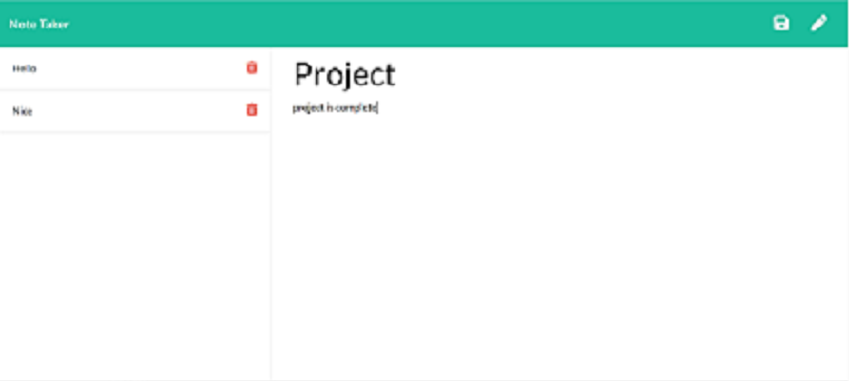

# Note-Taker

## Description:
Application that allows a user to take notes, save notes, and delete notes

## Tools:
* Express
* FS
* node.js

## User Guide:
The user is presented with a get started button on the home screen. When the user clicks the on the button
the user is presented with the note taking screen represented by the below image. The user then enters a title and a message.
Afterwards the user clicks the save button and the message is saved to the left side of the screen. The user can have multiple
notes and is presented with a trash icon which can be clicked to delete the note instantly.
 
 

 

## Github and Heroku Links:

https://github.com/JosephRhines/Note-Taker

